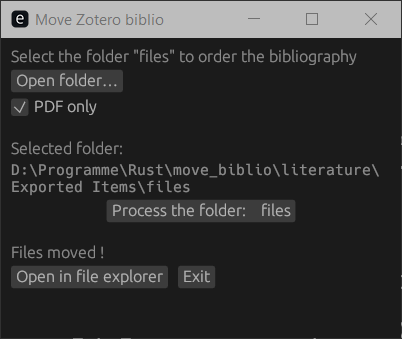
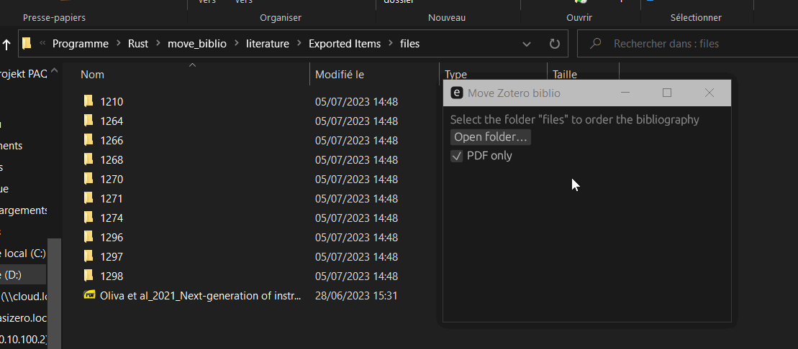

# FileMover or the software to move bibliographies

This script moves files stored in a folder to the parent folder for easier access. Other files are deleted.
It is intended to be used when exporting libraries with the software [Zotero](https://www.zotero.org/).


<div align="center">


[Download](https://github.com/S6ril/FilesMover/releases/)

</div>


## Quick use

This script move file from child folder to parent folder.

<table  align="center">
<thead>
  <tr>
    <th>Before</th>
    <th>After</th>
  </tr>
</thead>
<tbody>
<tr>
<td>
    
```bash                         
files              
    ├───1210       
    │       A.pdf  
    ├───1264       
    │       B.html 
    ├─── ***       
    └───C.pdf      
```
</td>
<td>

```bash 
files          
    ├───A.pdf  
    ├───B.html 
    ├─── ***   
    └───C.pdf  


``` 
</td>
</tr>
</tbody>
</table>

Only select the parent file, and click `Process files`!

<p align="center">
  
</p>

## Generate folder with the PDFs - Zotero

* Select all the PDFs you want to export.
* Right click on it, and select `Export items...`.
* Check the mark `Export Files`. (Default format `BibLaTeX` is good to go).
* Now you can select the folder `files` with the tool.


## Credits

<table  align="center">
<thead>
  <tr>
    <th>Libraries</th>
    <th>Version</th>
  </tr>
</thead>
<tbody>
<tr>
    <td>eframe</td>
    <td>0.22.0</td>
</tr>
<tr>
    <td>egui</td>
    <td>0.22.0</td>
</tr>
<tr>
    <td>env_logger</td>
    <td>0.10.0</td>
</tr>
<tr>
    <td>open</td>
    <td>5.0.0</td>
</tr>
<tr>
    <td>rfd</td>
    <td> 0.11.4</td>
</tr>
</tbody>
</table>


